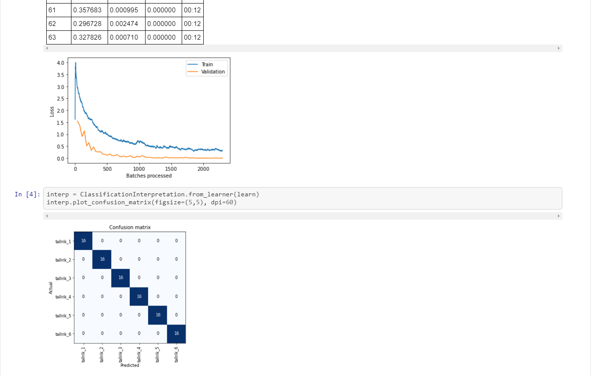
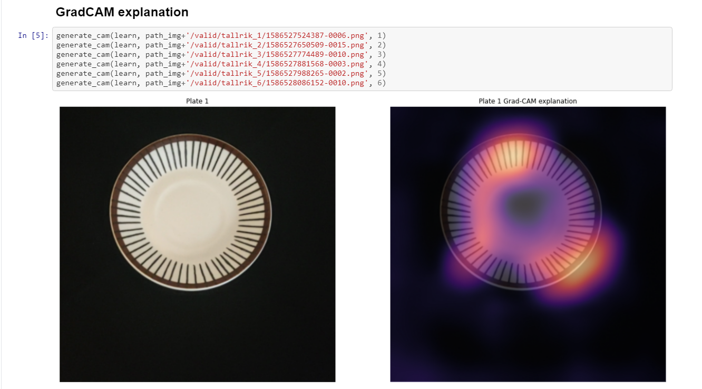
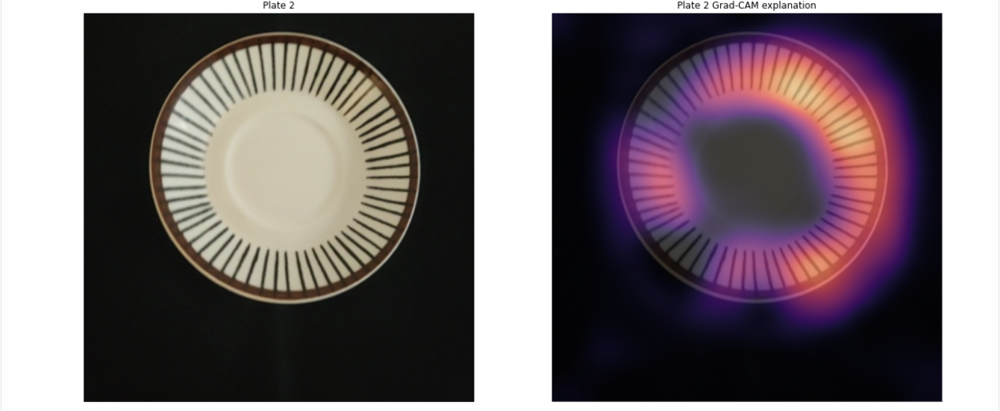

!This page is created to support double blind peer review
The non anonymous repository contains an Jupyter Notebook file similar to the one below. The file below is shorter in that all training data is not visible and some of the Grad-CAM images are not shown. 

